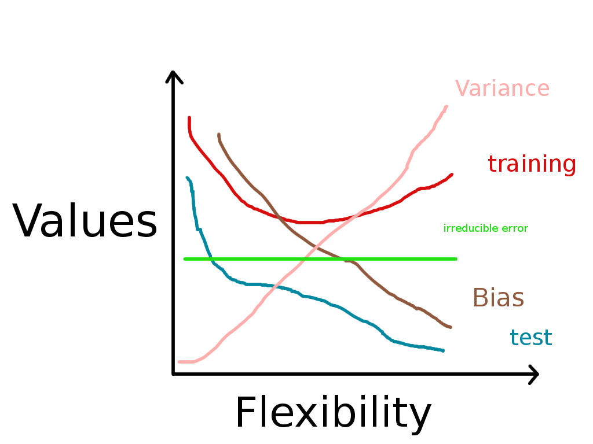

# Topic 1 Exercises


## Discussion Questions

### ISL 2.4.1

a) A flexible method would perform better because we have a very large sample size.

b) An inflexible will be better because we have a very small sample size.

c) Tyring to fit a linear model to data that is non-linear will give us a very bad model. Therefore, a flexible method would be better.

d) In this case, an inflexible method would be better because a high variance could lead to a problem of overfitting the data.

### ISL 2.4.3

a)




b) The test curve initially declines with increasing levels of flexibility, but then it increases again. It has a U shape. This is because there is a greater chance that the model will be overfitted and the test data will produce more error when there is high flexiblity in the model. The training curve declines always as the flexibility increases. This is because the data can be well fitted to the training data, making all of the points in the training data fit to the model. The general rule is that bias will always decrease with more flexible methods and variance will always increase with more flexible methods, according to the bias-variance tradeoff. The irreducible error stays constant no matter the ammount of flexibility in the model.


### ISL 2.4.6

Parametric approaches assume the shape of a model. Non parametric approaches require more data in order to fit the data in the model. 

## Computing Assignment

### ISL 2.4.8

a)

```{r}
library(ISLR)
data(College, package = "ISLR")
```
b)

(Using package)

c) 

i)

```{r}
summary(College)
```

ii) 

```{r}
pairs(College[,1:10])
```


iii)


```{r}
plot(College$Private, College$Outstate)
```

iv)

```{r}
Elite = rep (" No " , nrow ( College ) )
Elite [ College$Top10perc >50]=" Yes "
Elite = as.factor(Elite)
College = data.frame(College,Elite)
summary(College$Elite)
plot(College$Elite, College$Outstate)
```

v)

```{r}
par(mfrow=c(2,2))
hist(College$Grad.Rate, 5)
hist(College$Accept, 10)
hist(College$Top10perc, 5)
hist(College$Room.Board, 4)
```

vi)

In the historgram of the Colleges$Top10perc above, I find it interesting that it decreases along the x axis. This makes sense given that most students are not in the top 10 percent of their class, therefore most colleges will not have a high number of top 10 percent in their class.


### ISL 2.4.9

a)

```{r}
summary(Auto)
```

From the summary we can see that there are only two qualitative predictors, which are horsepower and name. All of the others are quantitative.

b)

```{r}
range(Auto$mpg)
range(Auto$cylinders)
range(Auto$displacement)
range(Auto$weight)
range(Auto$acceleration)
range(Auto$year)
range(Auto$origin)
```

c)

```{r}
mean(Auto$mpg)
mean(Auto$cylinders)
mean(Auto$displacement)
mean(Auto$weight)
mean(Auto$acceleration)
mean(Auto$year)
mean(Auto$origin)

sd(Auto$mpg)
sd(Auto$cylinders)
sd(Auto$displacement)
sd(Auto$weight)
sd(Auto$acceleration)
sd(Auto$year)
sd(Auto$origin)
```

d)

```{r}
autoMinus10To85 = Auto[-c(10, 85)]

range(autoMinus10To85$mpg)
range(autoMinus10To85$cylinders)
range(autoMinus10To85$displacement)
range(autoMinus10To85$weight)
range(autoMinus10To85$acceleration)
range(autoMinus10To85$year)
range(autoMinus10To85$origin)

mean(autoMinus10To85$mpg)
mean(autoMinus10To85$cylinders)
mean(autoMinus10To85$displacement)
mean(autoMinus10To85$weight)
mean(autoMinus10To85$acceleration)
mean(autoMinus10To85$year)
mean(autoMinus10To85$origin)

sd(autoMinus10To85$mpg)
sd(autoMinus10To85$cylinders)
sd(autoMinus10To85$displacement)
sd(autoMinus10To85$weight)
sd(autoMinus10To85$acceleration)
sd(autoMinus10To85$year)
sd(autoMinus10To85$origin)
```

e)
```{r}
plot(Auto$year, Auto$weight)
```

From the plot of weight to year we can see that newer cars tend to be heavier. As the year increases, the range in the weight of the cars decreases and, on average, they are lighter.

f)

```{r}
plot(Auto$cylinders, Auto$mpg)
plot(Auto$displacement, Auto$mpg)
plot(Auto$weight, Auto$mpg)
plot(Auto$acceleration, Auto$mpg)
plot(Auto$year, Auto$mpg)
plot(Auto$origin, Auto$mpg)
```
By looking at the plots, it appears that the variable mpg is negatively correlated with cylinders, displacement, and weight. It seems to have a positive corrlation with the origin, year and acceleration variables. However, the ones where there seems to be a stronger relationship are weight and displacement. Therefore, I would use these two variables to create a model to predict the variable mpg.

## Theory assignment

### ISL 2.4.2

a) Because salary is a numerical variable, we would be interested in regression. Because we are interested in understanding the factors that affect a CEO salary and not predicting someone's salary, this is an inference problem.

b) Given that we only have two outcomes, success and failure, this is a classification problem. Because we are tyring to predict the outcome of future products, we are interested in prediction.

c) Because the US dollar is an numerical variable, this is a regression problem. Given that we are interested in predicting the percentage change, we are interested in prediction.

### ISL 2.4.7

a) 

```{r}
sqrt((0-0)^2 + (3-0)^2 + (0-0)^2)
sqrt((2-0)^2 + (0-0)^2 + (0-0)^2)
sqrt((0-0)^2 + (1-0)^2 + (3-0)^2)
sqrt((0-0)^2 + (1-0)^2 + (2-0)^2)
sqrt((-1-0)^2 + (0-0)^2 + (1-0)^2)
sqrt((1-0)^2 + (1-0)^2 + (1-0)^2)
```

b) With K=1 we only look at the closest value. We see that the closes value is 1.4142, on the fifth row. For this entry, the color is green. Therefore, we would predict green.

c) With K=3 we look at the 3 closes values. These are 1.4142, 1.7321 and 2 on the fifth, sixth and second row. Out of these three values, two are red Therefore, we would predict red.

d) The best value of K would be small. This is because, given that it is highly nonlinear, we would prefer greater flexibility in the model.
